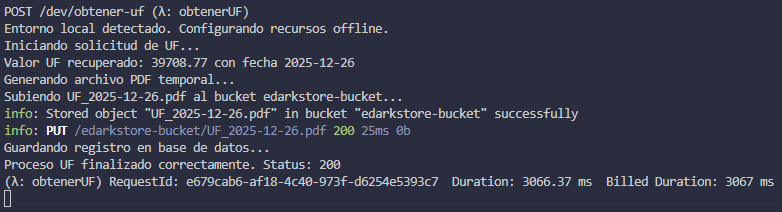
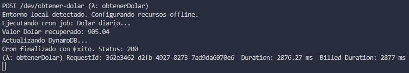
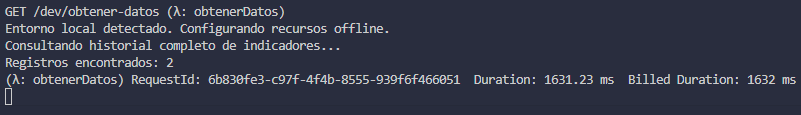
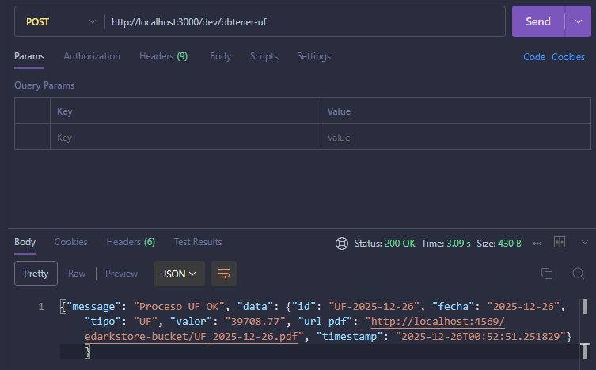
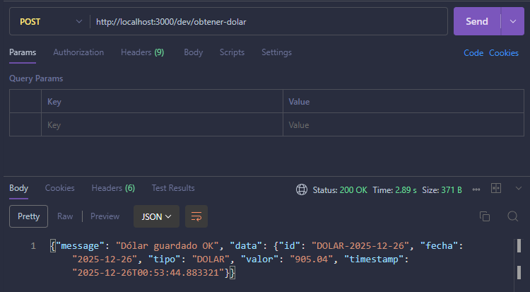
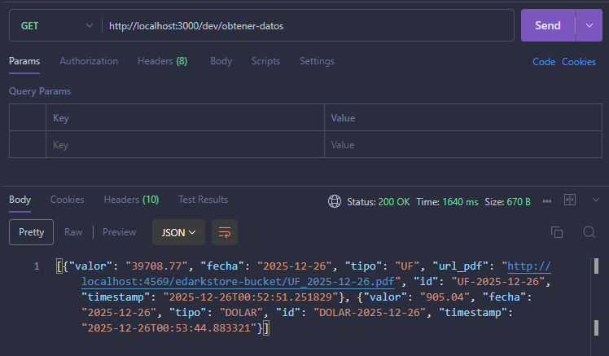

# Backend & Lambdas - Desafío Técnico eDarkstore

Este repositorio contiene la arquitectura Serverless (simulada localmente) para la gestión de indicadores económicos. El sistema obtiene la UF y el Dólar, genera reportes en PDF, almacena historial en DynamoDB y expone los datos vía API.

## Resumen de Funcionalidades
El proyecto cumple con los siguientes requerimientos técnicos:
* **Lambda UF:** Endpoint POST que consulta la UF diaria, genera un PDF, lo guarda en S3 y registra la metadata en DynamoDB.
* **Lambda Dólar:** Función programada (CRON) que obtiene el valor del Dólar y lo almacena en DynamoDB.
* **Lambda API:** Endpoint GET que entrega el historial consolidado para el Frontend.
* **Infraestructura Local:** Uso de plugins `serverless-offline` para simular API Gateway, DynamoDB y S3 en entorno de desarrollo.

## Stack Tecnológico
* **Lenguaje:** Python 3.9
* **Framework:** Serverless Framework v3
* **Base de Datos:** DynamoDB (Local)
* **Almacenamiento:** S3 (Local simulado en carpeta)
* **Librerías Clave:** `boto3`, `requests`, `fpdf`

---

## Instrucciones de Instalación

### 1. Instalación de Dependencias
Clonar el repositorio y ejecutar los siguientes comandos en la raíz del proyecto:

```bash
# 1. Instalar dependencias del Framework y Plugins
npm install

# 2. Instalar dependencias de Python (requests, fpdf, boto3)
pip install -r requirements.txt

# 3. Descargar e instalar el motor local de DynamoDB
sls dynamodb install
```

### 3.Ejecución del Proyecto
Para levantar los servicios (API Gateway, BD, S3):
```
serverless offline start
```
Aparecerá un mensaje en la terminal indicando que el servidor está escuchando en "http://localhost:3000".

## Documentación de Endpoints
| Método | Endpoint | Descripción |
| :--- | :--- | :--- |
| **POST** | `/dev/obtener-uf` | Obtiene UF actual, genera PDF en S3 local y guarda en BD. |
| **POST** | `/dev/obtener-dolar` | Ejecución manual del cálculo del Dólar (Simulación del CRON). |
| **GET** | `/dev/obtener-datos` | Retorna JSON con todo el historial ordenado por fecha. |

## Evidencia de Funcionamiento
### 1. Ejecución de Lambdas (Terminal)
Se observa el log de ejecución exitosa de las Lambdas en el entorno local `serverless-offline`.

Lambda obtener-uf



Lambda obtener-dolar



Lambda obtener-datos



### 2. Respuesta del API (Postman)
Prueba de los endpoints retornando status 200 y el objeto creado.

Endpoint `obtener-uf`



Endpoint `obtener-dolar`



Endpoint `obtener-datos`



### 3. Archivos Generados (S3 Local)
Visualización de los PDFs generados dentro del bucket simulado en la carpeta del proyecto.


### 4. Interfaz de Usuario (Frontend)
El sitio web consumiendo el API local y listando los indicadores.
